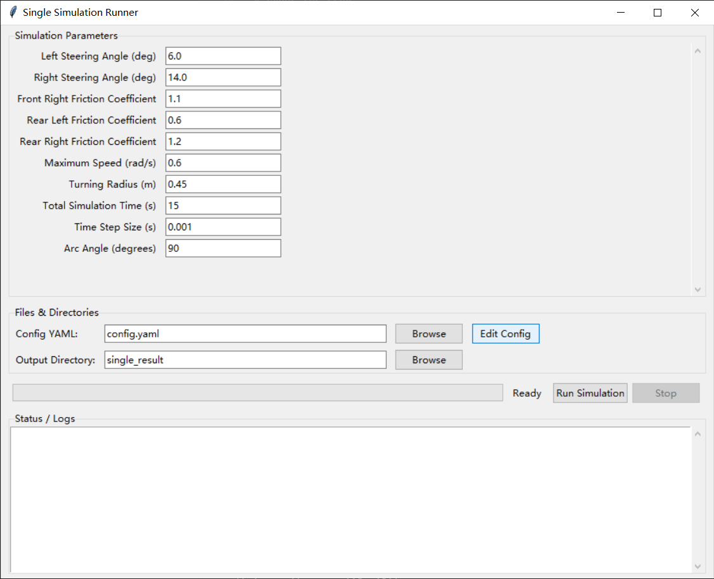
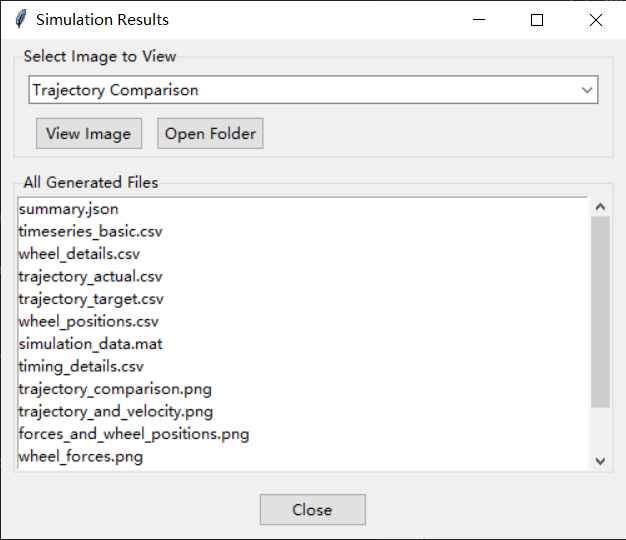

# Big Car Dynamics System

> A four-wheel-drive skid-steer vehicle dynamics simulator with a built-in GUI.

## 1. Project Overview
This repository contains a compact yet complete toolbox for simulating the **lateral dynamics of a skid-steer (differential drive) vehicle**.  
You can run a single steering scenario either through a cross-platform GUI or by calling the command-line script directly.

Key features:
* **Tkinter GUI** &mdash; zero extra dependencies, works on Windows/macOS/Linux.
* Physics engine based on a custom `Simulator` class with
  * Ackermann steering geometry.
  * Wheel–soil interaction model inspired by **Resistive Force Theory (RFT)**.
* Automatic export of results to **CSV, MAT, and PNG** formats.
* All parameters are fully configurable in `run/simulation_params.json` and `config.yaml`.

---

## 2. Requirements
* **Python 3.12+** (If a dependency is not yet 3.12-ready, Python 3.11 also works.)
* OS: Windows 10+, macOS, or any recent Linux distribution.

---

## 3. Calculation Principles  
*(Dynamic Resistive Force Model – DRFM)*

The simulation uses a **Dynamic Resistive Force Model (DRFM)** for wheel-soil interaction. The process involves:

1. **Mesh preprocessing**: Each wheel's STL file is converted offline into a PKL file containing a shape matrix. This matrix discretizes the wheel surface into triangular elements, storing position, normal vector, and area for each triangle.

2. **Per-triangle computation**: During simulation, DRFM calculates forces acting on each triangular surface element based on its local velocity, orientation, and penetration depth. The forces from all triangles are then integrated to obtain the total force and torque acting on the wheel.

This approach provides a good balance between computational efficiency and physical accuracy for granular media interactions.

---

## 4. Installation
```bash
# Clone the repo
$ git clone https://github.com/UPM-ROB-Lab/drfm-simulation.git
$ cd drfm-simulation

# Install all Python packages
 $ pip install -r requirements.txt
```

---

## 5. Quick Start
```bash
$ python gui_simulation_runner.py
```
A window similar to the screenshot below will open (replace the placeholders with the real path of your images):



1. Fill in or adjust the *Simulation Parameters* on the left.
2. Click **Edit Config** to fine-tune low-level vehicle/RFT parameters stored in `config.yaml`.
3. Choose the output directory and press **Run Simulation**.
4. When the run finishes, a result viewer pops up automatically, and all data files are saved.



---

## 6. Output Files
After each run (default directory `single_result/`) you will find:
| File | Description |
|------|-------------|
| `summary.json` | All input parameters plus high-level KPIs |
| `timeseries_basic.csv` | Per-step position, velocity, energy consumption |
| `wheel_details.csv` | Forces & torques (X/Y/Z) for all four wheels |
| `wheel_positions.csv` | Center positions of each wheel |
| `trajectory_actual.csv` / `trajectory_target.csv` | Actual vs. reference path |
| `simulation_data.mat` | Full data for MATLAB users |
| `trajectory_comparison.png` | Overlay of actual vs. reference trajectory |
| `wheel_forces_X/Y/Z.png` | Force curves per axis |
| `wheel_torques.png` | Torque curves |

The GUI's result viewer lets you browse the most relevant PNG images immediately.

---

## 7. Directory Layout
```
big_car_dynamics_system/
├── gui_simulation_runner.py   # GUI entry point
├── run/
│   └── run_single_simulation.py
├── simulator.py               # Core physics engine
├── plotter.py                 # Charts & data export helper
├── model/                     # STL meshes and pre-processed wheel matrices
├── config.yaml                # Vehicle/RFT config
└── requirements.txt           # Python dependencies
```
---
## 8. License
MIT

---

## 9. Acknowledgements
* NumPy · SciPy · Matplotlib · Pandas
* PyVista & `numpy-stl` for 3-D mesh handling
* Numba and Tqdm for extra speed and usability
* MATLAB File Exchange contributions that inspired parts of the RFT implementation:
  * [Granular Intrusion Modeling with 3D RFT](https://www.mathworks.com/matlabcentral/fileexchange/130264-granular-intrusion-modeling-with-3d-rft)
  * [Reduced-Order Granular Intrusion Modeling using RFT](https://www.mathworks.com/matlabcentral/fileexchange/75389-reduced-order-granular-intrusion-modeling-using-rft)
  
  *Some functionality was implemented by adapting and optimizing code from these MATLAB resources.*

* Development tools and AI assistance:
  * [Roo Code](https://github.com/RooCodeInc/Roo-Code) and [Cursor](https://cursor.sh/) for AI-powered code editing
  * AI models: Gemini 2.5 Pro, GPT-4o, GPT-o3, and Claude 4.0 Sonnet for code optimization and debugging 
